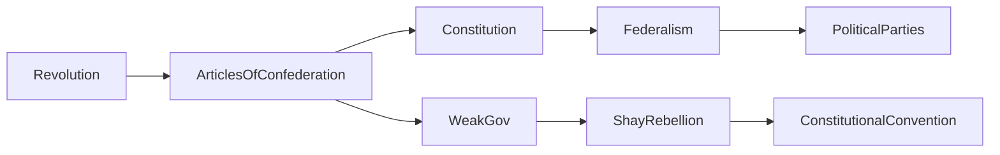
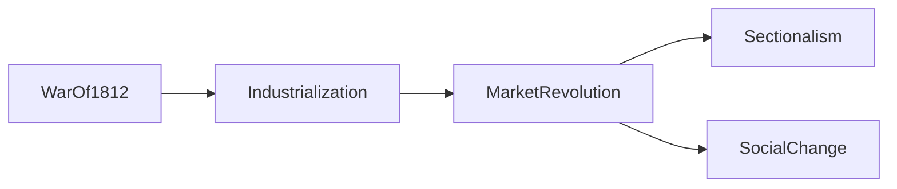

# Study Guide #2

_**Nirav Surabhi**_

---

## Key
Arrows show **_Continuity and Change Over Time_** (Long Term Trends → Shifts in Ideas)

```{.mermaid format=svg}
%%{init: {"flowchart": { "htmlLabels": false}} }%%
flowchart LR
LongTerm --> Change
LongTerm --> Continuity
```

---

## Periods 3–4: Road to Revolution & Early Government

---

### Causes of the Revolution


- **Seven Years' War (1754–1763)**: France and Britain battled for control of North America; Britain won but racked up huge debt.
- **End of Salutary Neglect**: Britain cracked down on the colonies to pay war debt — enforcement of **Navigation Acts**, new **taxes**.
- **Sugar Act** and **Stamp Act** introduced direct taxation on colonists, sparking the cry of “No taxation without representation.”
- **Sons and Daughters of Liberty** organized protests and boycotts; **Stamp Act Congress** petitioned for repeal.
- Britain repealed the Stamp Act but replaced it with the **Declaratory Act**, asserting total control over colonies.
- **Townshend Acts** taxed imports like glass and tea. Colonists responded with intellectual resistance (John Dickinson’s *Letters from a Farmer*) and physical action.
- **Boston Massacre (1770)** and **Boston Tea Party (1773)** intensified conflict → British passed **Intolerable Acts** as punishment.
- **First Continental Congress (1774)** met to organize resistance; still loyal but united.
- After **Lexington and Concord**, and especially after **Common Sense** by Thomas Paine, momentum shifted toward **independence**.

---

### Early Government & Political Changes



- **Articles of Confederation** created a weak central government — no power to tax, enforce laws, or raise a military.
- Strengths: Won the war, passed **Northwest Ordinance (1787)** — banned slavery north of the Ohio River.
- Weaknesses exposed in **Shays’ Rebellion** — farmers revolted due to high taxes, showing federal weakness.
- **Constitutional Convention (1787)** created a stronger government, balancing state and federal powers.
- Key compromises:
    - **Great Compromise**: House = population; Senate = equal.
    - **3/5 Compromise**: 3 of every 5 enslaved persons count for representation.
- **Federalists** (Hamilton, Madison) supported the new Constitution; wrote **The Federalist Papers**.
- **Anti-Federalists** (Mason, Henry) opposed it until **Bill of Rights** was added.
- Washington’s presidency set precedent: **neutrality**, **two terms**, and **cabinet system**.
- Political rift: **Hamilton’s Financial Plan** (national bank, tariffs) vs. **Jeffersonian Republicans** (agrarianism, strict Constitution).
- By the **Election of 1800**, power peacefully shifted to Jefferson and the Democratic-Republicans — a key moment in American democratic tradition.

---

### Changes of the Market Revolution



- **War of 1812** reaffirmed US independence and boosted nationalism.
- **Market Revolution**: A shift from home production to factory work, linked to transportation innovations (canals, roads, railroads).
- **Cotton Gin** (1793) by Eli Whitney supercharged slavery in the South.
- **Lowell System** brought young women into factory work in the North.
- **Steamboats** and **Erie Canal** revolutionized trade and connected markets.
- **Interchangeable parts** increased manufacturing efficiency.
- Economic gaps grew — **North industrialized**, **South remained agricultural**, **West supplied raw goods**.
- This **sectionalism** created tensions that would eventually lead to conflict.

---

## Historical Perspective
**Alexander Hamilton** championed a vision of a strong centralized government and industrial future — a clear contrast to Jefferson's rural idealism. His ideas still influence American fiscal policy today.

---

## Primary Source Analysis
**Excerpt from Thomas Paine’s _Common Sense_ (1776):**
>"The cause of America is in a great measure the cause of all mankind."

→ Paine argues not only for independence but for a broader philosophical break from monarchy and inherited power. This rallied common people to the revolutionary cause and reframed the struggle as a global one.

---

## Essay Prompt (CCOT)
>Evaluate the extent to which the American Revolution and early formation of government (1775–1800) represented a change in political ideology and continuity in economic structure.

---