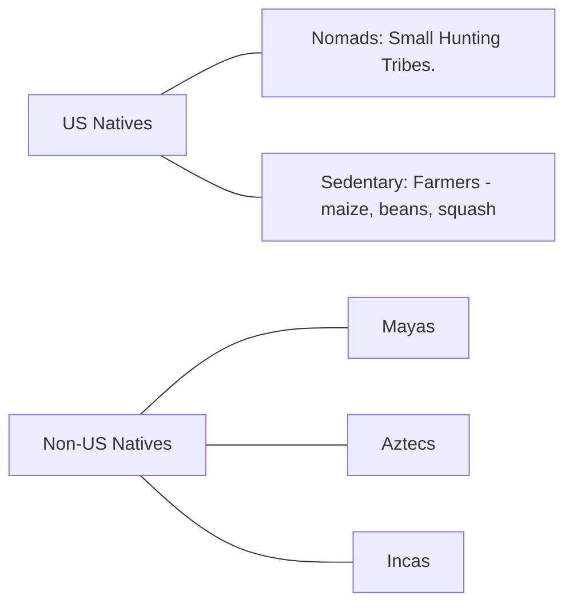
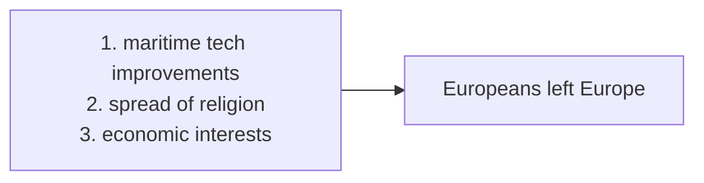
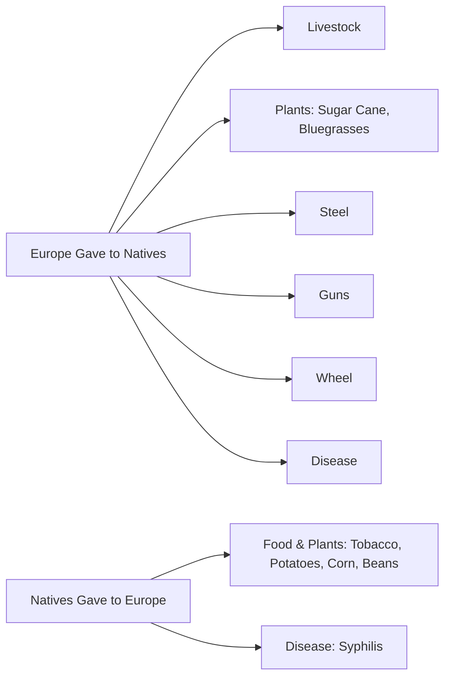
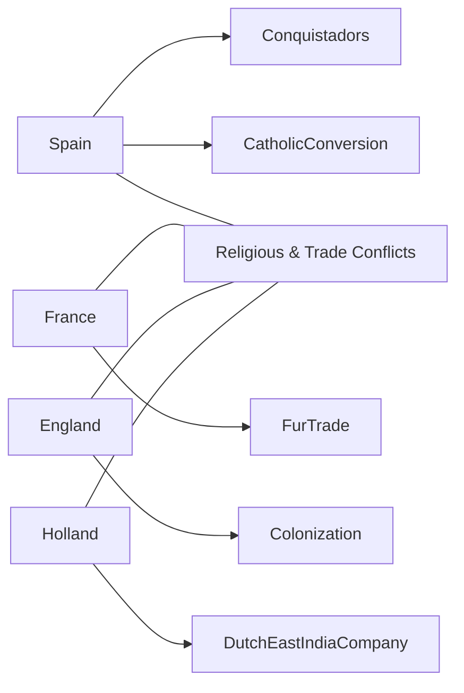
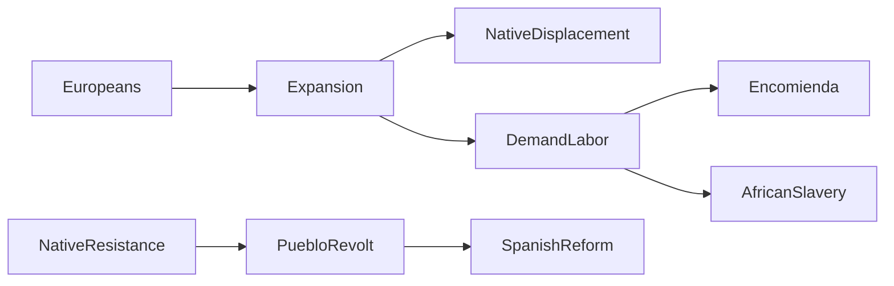

# Study Guide #1 

_**Nirav Surabhi**_

---

## Key  
Arrows show **_Causation_** (Cause → Effect)

Lines without arrows show **_Relation_**

## Periods 1–2: Colonization & Colonial America

---

### Native Americans (Pre-European Contact)

Asians crossed land bridge from modern-day Russia to Alaska.

- Native societies were diverse  
- Had complex religions, trade networks, and forms of governance  

---

### Colonial Regions & Society

1. Advances in shipbuilding, navigation (like the compass), and info-sharing (printing press) kicked off a Nautical Revolution.  
2. Religious motives: Spain expelled Jews/Muslims; Protestants in Northern Europe also sought refuge.  
3. Trade ambitions pushed Europeans to bypass the Ottoman-controlled Silk Road and sail westward.

**Columbus** - "Discovered" America → set off an exchange of goods, diseases, and cultures

#### Columbian Exchange

---

### European Rivalries

- **Spain**: Colonized early with violent conquest and forced conversion (Encomienda system)
- **France**: Formed alliances with Natives via fur trade and intermarriage
- **England**: Colonies formed around agriculture, profit, and religion (e.g., Virginia for tobacco; Massachusetts for Puritans)
- **Dutch**: Settled New Amsterdam (later NYC), focused on commerce via Dutch East India Company

---

### Tensions: Natives, Africans, Europeans

- **Encomienda System**: Spanish used Natives for labor in exchange for conversion, often violently.
- **Asiento System**: As Natives died from disease and abuse, the Spanish imported enslaved Africans.
- **Bartolomé de Las Casas**: Spanish priest who opposed Native enslavement and exposed cruelty → his accounts influenced Spanish reforms.
- **Pueblo Revolt (1680)**: Led by Popé, Natives in New Mexico resisted Spanish rule and won temporary autonomy.
- Early **English colonists** had mixed relations with Natives — from trade and peace to brutal conflict (e.g., King Philip’s War).
- **Africans**: By 1619, Africans began arriving in Virginia as laborers; slavery hardened by 1660s into racial caste.

---

## Historical Perspective  
**Bartolomé de Las Casas** provides a Catholic moral critique of conquest, showing that not all Europeans supported exploitation. His writings helped shape Spanish law and moral views on colonization.

---

## Primary Source Analysis  
**Excerpt from Las Casas’ writings** (translated):  
>"What we committed in the Indies stands out among the most unpardonable offenses ever committed against God and mankind."

→ This quote emphasizes the brutality of the Spanish and the hypocrisy of their Christian mission, foreshadowing debates about imperialism and human rights.

---

## Essay Prompt (Causation)  
>Evaluate the extent to which European colonization caused major changes in Native American societies in the period 1491–1754. In your response, focus on economic, social, and political changes.

---
